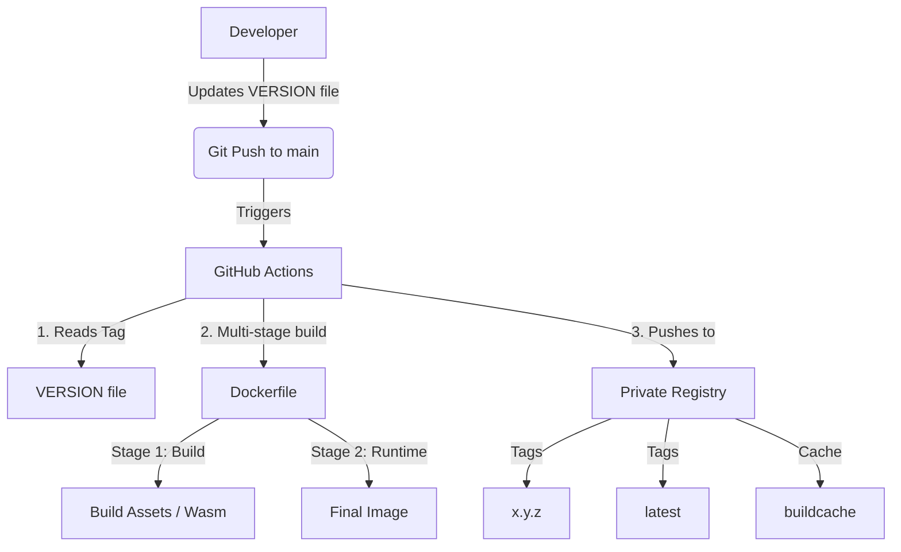

# Docker Build & Automation Strategy

This document outlines the architecture, automation triggers, and naming conventions for the Dockerized deployment in this repository. You can use this guide as a template to replicate the same strategy across other projects.

---

## 🏗️ 1. Architecture Overview



The strategy combines **version-file-driven triggers**, **multi-stage Docker builds**, and **GitHub Actions** to deliver optimized, multi-architecture containers to a private registry with build cache management.

---

## ⏱️ 2. Build Triggers

Instead of triggering a build on every code change (which slows down development and inflates registry storage), the pipeline is strictly gated:

1.  **Automatic Trigger (`VERSION` update)**:
    -   The workflow listens *only* to changes in the `VERSION` file in the root directory.
    -   Configuration in `.github/workflows/docker-publish.yml`:
        ```yaml
        on:
          push:
            paths:
              - 'VERSION'
        ```
    -   This guarantees that CSS edits, README typos, or safe commits do not waste CI minutes or push "untracked" containers.

2.  **Manual Trigger (`workflow_dispatch`)**:
    -   Included for emergencies, allowing developers to force a rebuild directly from the GitHub Actions tab without incrementing the version.

---

## 🛠️ 3. Automatic Build Workflow (CI/CD)

The GitHub Actions pipeline automates the packaging and publication of the image using modern Docker toolchains:

1.  **Environment Setup**:
    -   **QEMU**: Enables emulation so the runner can build images for non-native boards (e.g., building ARM64 on an AMD64 GitHub runner).
    -   **Docker Buildx**: Extended builder tool required for multi-arch support and registry caching.
2.  **Registry Authentication**:
    -   Uses secrets safely injected via GitHub repository settings (`DOCKER_REGISTRY_USERNAME`, `DOCKER_REGISTRY_PASSWORD`).
3.  **Advanced Layer Caching**:
    -   Uses registry-based caching:
        ```yaml
        cache-from: type=registry,ref=${{ env.REGISTRY }}/${{ env.IMAGE_NAME }}:buildcache
        cache-to: type=registry,ref=${{ env.REGISTRY }}/${{ env.IMAGE_NAME }}:buildcache,mode=max
        ```
    -   This pulls existing layers from the registry rather than starting from scratch, making subsequent builds (e.g., node module installs) much faster.

---

## 📦 4. Docker Container Specs & Construction

To minimize image size while accommodating complex compilation pipelines, the layout uses a **Multi-Stage Build**:

### 🔹 Stage 1: Build & Asset Compilation (Node.js)
-   **Base Image**: `node:18-slim` (Keeps the surface area small).
-   **Purpose**: Running safe dependencies (`npm ci`) and compiling sources (e.g., AssemblyScript to `.wasm` binaries).
-   **Benefit**: Keeps Node.js, developer tooling, and `node_modules` completely *out* of the production container.

> [!NOTE]
> **Flexibility**: If your application does not use Node.js (e.g., pure Python, Go, or Java), you should replace this base image with whatever your build tooling requires (e.g., `golang:1.21-alpine` or `maven:3.8-openjdk`). If your application requires no heavy compilation step before execution, this stage can be removed entirely in favor of a **single-stage build**.


### 🔹 Stage 2: Application Runtime (Python)
-   **Base Image**: `python:3.10-slim`
-   **Execution Layout**:
    1.  Copies `requirements.txt` and installs wheels.
    2.  Copies the actual application source code.
    3.  **Crucial Step**: Copies the compiled binaries *from* the build stage:
        ```dockerfile
        COPY --from=builder /build/static/model.wasm /app/static/model.wasm
        ```
-   **Runtime Execution**: Launches a high-performance WSGI/ASGI layout (like `uvicorn main_web:app`).

---

## 🏷️ 5. Naming & Tagging Conventions

During the build step, the container receives multiple labels to support both **immutable rollbacks** and **rolling releases**:

-   **Version Tag** (`X.Y.Z`):
    -   Matches the exact contents of the `VERSION` file (e.g., `1.1.8`).
    -   **Use Case**: Production deployments. It never changes, making it perfect for deterministic rollbacks.
-   **Latest Tag** (`latest`):
    -   Automatically overwrites to point to the newest successful build.
    -   **Use Case**: Development and testing environments that always want the newest features without updating deployment scripts.
-   **Cache Tag** (`buildcache`):
    -   Internal reference used strictly for pushing/pulling Docker layer cache data.

---

## 📋 6. Replication Guide (Applying to Other Repos)

To import this exact pipeline setup into a duplicate or sister repository:

1.  **Prepare local control files**:
    -   Add a `VERSION` file detailing the release (e.g., `0.1.0`).
    -   Add a `bump-version.sh` to increment the `.Z` patch automatically, commit, and push.
2.  **Add Configuration**:
    -   Copy `.github/workflows/docker-publish.yml` to the targeted repository.
    -   Update the `IMAGE_NAME` in the `env:` block.
3.  **Setup Secrets**:
    -   Go to Repository `Settings` -> `Secrets and variables` -> `Actions`.
    -   Add `DOCKER_REGISTRY_USERNAME` and `DOCKER_REGISTRY_PASSWORD`.
4.  **Write Multi-Stage Dockerfile**:
    Ensure any asset preprocessing (webpack, vite, or binary builds for languages like Go/Rust) is performed in an appropriate `builder` stage, then copied forward securely into a `slim` final stage to keep the image size minimal. If no pre-compilation is needed, a single-stage Dockerfile is fully compatible with this pipeline.

