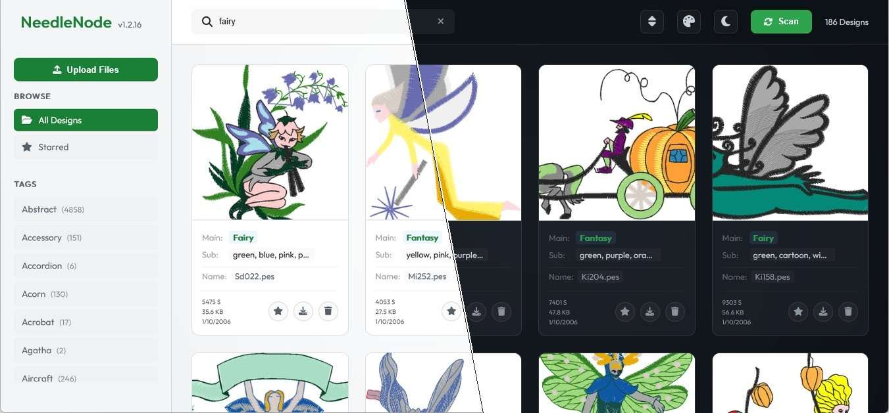

# NeedleNode

A high-performance local web application to organize, tag, and browse thousands of embroidery files (PES, DST, JEF, etc.) with AI-powered classification and a rich, responsive interface.



## Key Features

-   **AI-Powered Inbox Classification**: Automatically sort, rename, and tag incoming designs using Gemini Vision with parallel batch processing and dominant color extraction.
-   **High Performance Catalog**: Smooth grid view with infinite scroll, optimized for libraries of 30,000+ files with sharded thumbnail caching.
-   **Advanced Metadata Tracking**: Extract and display physical dimensions (mm), stitch counts, and color palettes directly from embroidery binary headers.
-   **Dynamic UI Personalization**: Fluid Light/Dark mode switching with persistent Color Accent customization (Green, Blue, Orange).
-   **Robust File Management**:
    -   **Direct Uploads**: Add new designs immediately via the browser.
    -   **Soft Deletion**: 5-second "Undo" toast for safe and fast curation.
    -   **Multi-Format Conversion**: Download designs in any supported format (PES, DST, JEF, EXP, etc.) on-the-fly.
-   **Mobile First Design**: Fully responsive layout with a collapsible sidebar and optimized scan/import progress tracking for small screens.
-   **Offline Ready**: All fonts and assets are embedded locally, ensuring 100% functionality in air-gapped or restricted network environments.

## Tech Stack

-   **Backend**: Python 3.12+ with **FastAPI**
    -   **Concurrency**: Multi-worker **Gunicorn** setup for high simultaneous request capacity.
    -   **Database**: **SQLite** with Write-Ahead Logging (**WAL**) and Synchronous Normal modes for non-blocking concurrent I/O.
    -   **Parsing**: `pyembroidery` (Embroidery formats) and `Pillow` (Rendering).
-   **Frontend**: **Vanilla JS / HTML / CSS** utilizing modern design standards (Gradients, micro-animations, Grid/Flex layouts).
-   **Deployment**: Fully **Dockerized** with multi-architecture support (amd64/arm64) and optimized non-root execution.

## Quick Start (Docker)

The fastest way to deploy NeedleNode is using Docker Compose:

1.  **Configure Environment**: Create a `.env` file with your Gemini API Key:
    ```bash
    GEMINI_API_KEY="your_api_key_here"
    ```
2.  **Launch**:
    ```bash
    docker compose up -d
    ```
3.  **Access**:
    Open [http://localhost:8000](http://localhost:8000) in your browser.

*For local development without Docker, use `./start.sh` and `./stop.sh` scripts.*

## Project Structure

-   `library/`: The primary organized archive. Files are moved here after classification or scanning.
-   `inbox/`: Landing zone for new unorganized files waiting for AI classification.
-   `trash/`: Safe buffer for deleted files, including an `SKIPPED/` subfolder for corrupted or oversized designs.
-   `backend/`: FastAPI server logic, database models, and background workers.
-   `frontend/`: Single-page application assets (HTML, CSS, JS).

## Library Organization

NeedleNode enforces a structured hierarchy to ensure portability:

-   **Folder-Based Categories**: Top-level subdirectories in `library/` represent the **Main Tag**.
-   **Standardized Naming**: Classified files follow the pattern:
    `[Main Tag] ([sub_tag1],[sub_tag2],...) [Original Name].[extension]`

This structure allows the built-in scanner to reconstruct the entire metadata database even if the SQLite file is deleted, ensuring your organization is never locked into the application.

## License

NeedleNode is licensed under the **[GNU Affero General Public License v3.0](LICENSE)**.

In short — you are free to use, run, modify, and distribute this software, including commercially. In return:

-   Any distributed or modified version must remain under the AGPL-3.0 and ship its source.
-   **If you run a modified version as a network service, you must offer its source to your users** (AGPL §13). This is the clause that separates the AGPL from the plain GPL.

Copyright © 2025 Artem Davtyan

## Third-Party Assets

NeedleNode bundles the following assets locally to support offline use. Full license texts are included alongside the files.

-   **[Font Awesome Free](https://fontawesome.com) 6.5.1** — © Fonticons, Inc. Icons: [CC BY 4.0](https://creativecommons.org/licenses/by/4.0/), Fonts: SIL OFL 1.1, Code: MIT. See [`frontend/vendor/font-awesome/LICENSE.txt`](frontend/vendor/font-awesome/LICENSE.txt).
-   **[Outfit](https://github.com/Outfitio/Outfit-Fonts)** — © 2021 The Outfit Project Authors, licensed under [SIL Open Font License 1.1](http://scripts.sil.org/OFL). See [`frontend/vendor/outfit/LICENSE.txt`](frontend/vendor/outfit/LICENSE.txt).

## Scaling & Security

-   **High Concurrency**: Ships with 4 Gunicorn workers by default, capable of handling 1000+ simultaneous connections.
-   **Memory Safety**: AI processing includes circuit breakers for "Decompression Bombs" and explicit memory management to run reliably on low-RAM hardware like NAS or Raspberry Pi.
-   **Non-Root Execution**: Docker containers run as user `1000:1000` for host-level file permission security.
